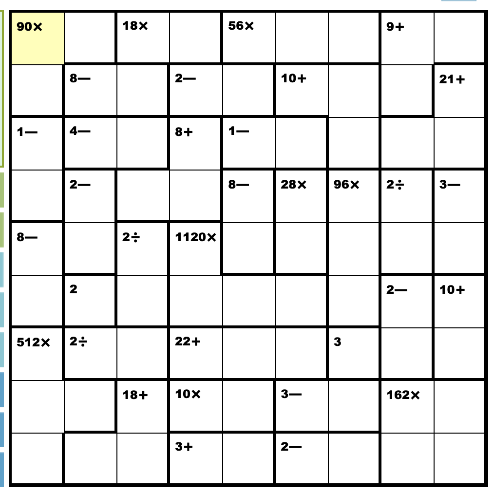

# KenKen Solver

Uses image processing and backtracking algorithms to find a kenken board from an image and solve it. 

## Rules

KenKen is a constraint satisfaction problem (CSP), in which a board looks like the following:



The following rules must be satisfied:
- Numbers must range between one and the side length of the board, inclusive. In this case, they range from 1-9.
- All numbers in a row must be unique.
- All numbers in a column must be unique.
- Within each dark block, the numbers must be able to be manipulated to result in the given operation.
    - For addition, the numbers must have a sum equal to the value.
    - For multiplication, the numbers must have a product equal to the value.
    - For subtraction, the absolute difference between numbers (always two) must be the value.
    - For division, the larger number divided by the smaller number must be equal to the value.
    - For squares with no operation, it is treated as a given constant value.

A solved board for this puzzle is available below:


## Usage
To run the program, clone this repository and open it in a code editor. You need to create a virtual environment by running the following:

```
% python3.10 -m venv .venv
```

Then, you need to install the required dependencies. To do this, run this:

```
pip install -r requirements.txt
```

This reads from the `requirements.txt` file available [here](https://github.com/vivaansinghvi07/kenken-solver/blob/main/requirements.txt), and installs everything needed to run the project.

Then, you can run the `main.py` file or `walkthrough.ipynb` file (instructions below).

## Running the Code

### `main.py`

To run `main.py`, which directly solves a puzzle and outputs an image, run the following within your virtual environment:

```
% python main.py <FILENAME> --skip-verification --new-file
```

The options shown in the example are both optional. `--skip-verification`, or `-s` for short, allows the user to skip the verirication step (which makes sure their image was properly processed), and `--newfile`, or `-n` for short, creates a new file holding the solved image, rather than saving it onto the original file.

To generate `kenken_solved.png` from `kenken.png`, I ran the following:

```
% python main.py kenken.png -s -n
```

### `walkthrough.ipynb`

This file walks you through each step involved in solving the puzzle, with displayed images and more.

## How It Works

As mentioned above, each step in this process is visible in `walkthrough.ipynb` [here](https://github.com/vivaansinghvi07/blob/main/walkthrough.ipynb).

To process the image, the program first determines where the board is on the image, and assumes that the board takes up the largest area on the page. It then crops the image to perfectly fit the board.

Then, it blurs the image in order to seperate thicker lines from the thinner ones. This allows the program to determine which squares are in each group. After determining which squares fit together, an OCR is used to analyze what operations are done on each image.

After the image is processed, each relationship is analyzed to create the board, from which the program uses a simple backtracking approach to solve the puzzle.

Then, the board is written onto the original image and the image is saved.